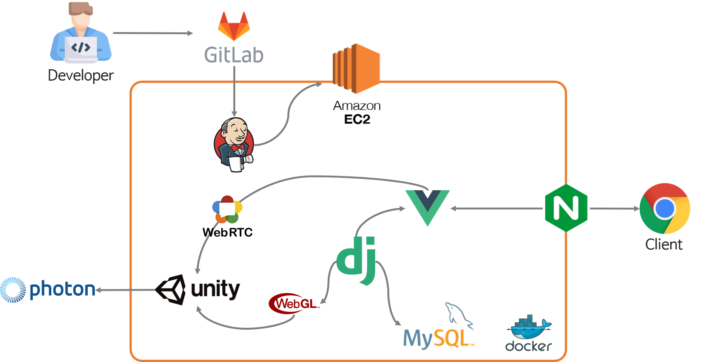

# README

### 목차

---

0. 팀 소개

1. 서비스 소개

2. 기술 스택

3. 데이터 수집 및 추천 알고리즘

4. 아키텍처 상세

5. 레이아웃 및 디자인

---

## **0. 팀 소개**

- **팀장** 박준수 : Frontend, Unity
- 팀원 류지우 : Unity
- 팀원 성루비 : Backend, Unity
- 팀원 윤소영 : Frontend, WebRTC, Devops
- 팀원 이혜은 : Frontend, Unity

### **🗓️구현 기간**

2021.10.11 - 11.19

## **1. 서비스 소개**

> 메타버스 환경의 원데이 클래스

### **1.1. 타겟 고객군**

- 온라인에서도 현장감 있는 수업을 원하는 튜터
- 온라인으로 다양한 취미를 즐기고 싶은 튜티

### **1.2. 주요 기능**

### **1.2.1. 수업 개설 및 신청**

1. 강사의 강의 신청 후 수업을 운영진이 인가하여 수업 개설
2. 카카오 API 를 이용한 수업 결제

### 1.2.2. 수강 관리

1. 강사와 학생은 마이페이지에서 자신의 수업을 확인하고 관리
2. 자신의 수업 교실 비밀번호 확인 후 그 비밀 번호로 접속

### 1.2.3. Unity

1. 애니메이션과 건물 하이라이팅으로 UI 활성화
2. 자신을 대표하는 캐릭터 선택
3. 간단한 게임을 접속할 수 있는 공간

### **1.2.2. WebRTC**

1. 화상 통화를 통한 튜터와 튜티의 만남
2. 채팅을 통한 튜터와 튜티의 소통
3. 화면 공유를 통한 수업 효과 증대

### 1.2.3. Photon Server

1. Multi Play

## **2. 기술 스택**

### **2.1. 유니티**

- Unity 2020.3.20f1
- Photon

### **2.2. 백엔드**

- Python 3.8.7
- Django 3.2.7
- Swagger
- Postman
- MariaDB

### **2.3. 프론트엔드**

- Vue.js 3.2.20
- OpenVidu

### **2.4. 배포**

- AWS EC2
- Docker
- Nginx

### **2.4. 프로젝트 관리**

- GitLab

- Jenkins

- Notion

- Jira

- Google Sheet

  

## **3. 메타버스 환경 구축**

### **3.1. 3D 맵 구성**

- 교실

### **3.2. 포톤 멀티 서버**

- 멀티플레이
- 음성 채팅

### 3.3. 게임 공유

- 게임 오브젝트로 같이 게임 가능

## **4. 아키텍처 상세**

- 아키텍처

  

- ERD

  

## **5. 레이아웃 및 디자인**

- 와이어 프레임 (Figma)

  - Unity

  

  - Web

  

